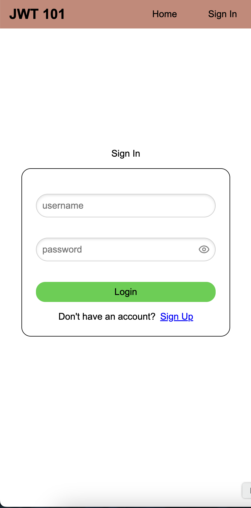
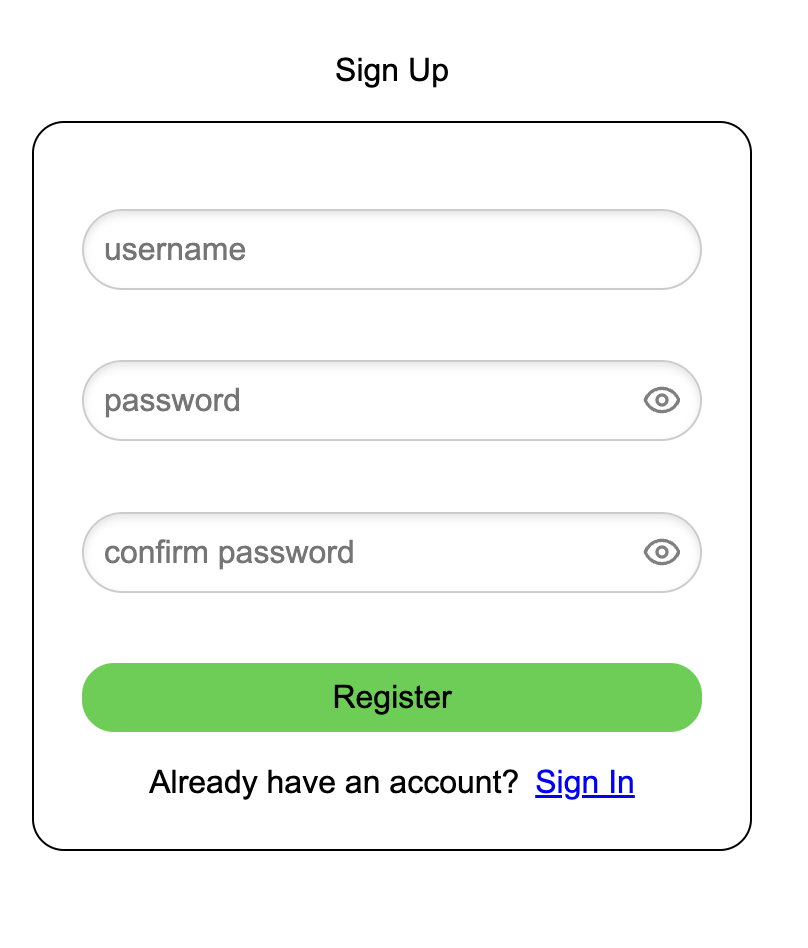
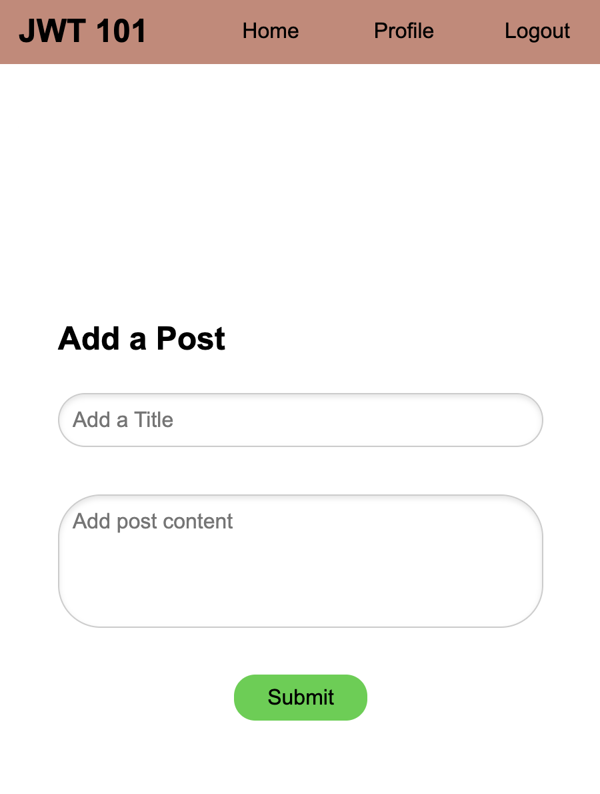

# JWT-101

This is a demonstration app for JWTs. Backend GitHub repo: https://github.com/llevasseur/jwt-101-api

# Installation

npm i

npm run dev

# Screenshots

### Login & Register

### Posts

